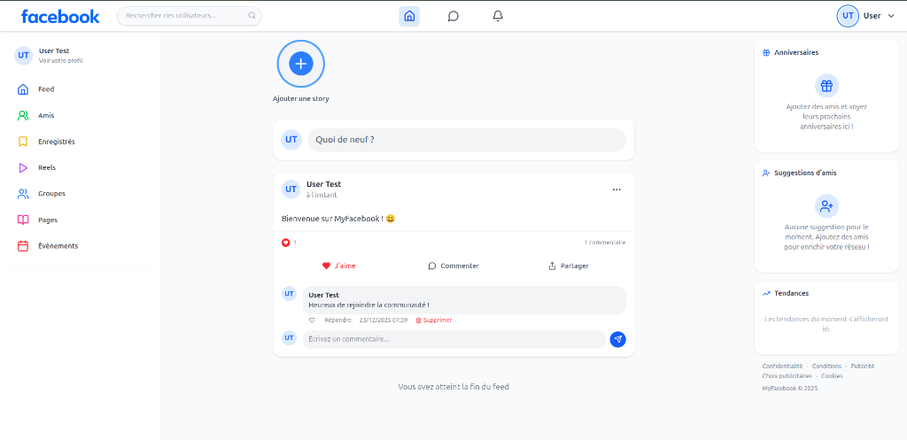
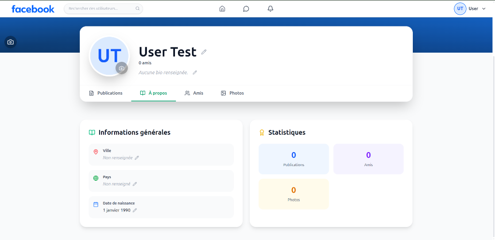
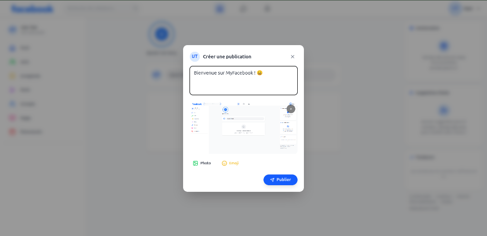
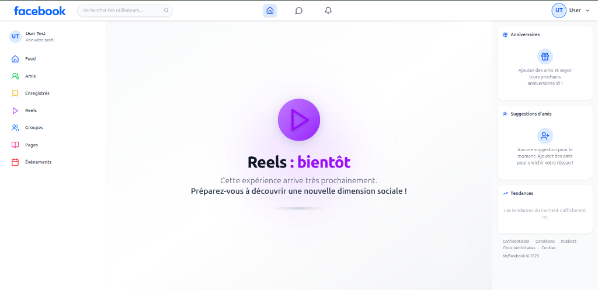

# 📘 MyFacebook

[](https://reactjs.org/)
[](https://php.net/)
[](https://www.postgresql.org/)
[](https://tailwindcss.com/)
[](https://vitejs.dev/)

**MyFacebook** est une plateforme de réseau social sophistiquée, conçue pour offrir une expérience utilisateur fluide et moderne inspirée des standards actuels. Alliant la puissance de **React 19** en frontend et la robustesse de **PHP 8** couplé à **PostgreSQL** en backend, ce projet démontre une architecture full-stack complète et évolutive.

---

## 📸 Aperçu de l'Interface

> [!NOTE]
> L'interface a été conçue avec une attention particulière à l'esthétique et à l'ergonomie, utilisant Tailwind CSS pour un rendu premium.


*Le flux social principal intégrant les stories et le système de publications.*

````carousel

<!-- slide -->

<!-- slide -->

````

---

## ✨ Fonctionnalités Clés

### 👤 Gestion du Compte & Profil
- **Sécurité Avancée** : Authentification via **JWT (JSON Web Tokens)** avec gestion des sessions.
- **Cycle de vie** : Inscription avec confirmation d'email (templates HTML pros) et réinitialisation de mot de passe sécurisée.
- **Personnalisation** : Profil complet avec photo, couverture, bio riche et statistiques d'activité.

### 🌐 Social & Engagement
- **Flux Dynamique** : Système de publications (texte, images) avec interactions en temps réel.
- **Engagement** : Likes polymorphes, commentaires imbriqués et système de partage.
- **Stories** : Partage de moments éphémères avec légendes personnalisées.
- **Mises en relation** : Système d'amitié complet avec suggestions intelligentes basées sur les amis en commun.

### 💬 Communication & Notifications
- **Messagerie Instantanée** : Chat privé fluide avec historique des conversations.
- **Notifications Alertes** : Système de notifications en temps réel pour toutes les interactions sociales.

### 🛡️ Administration & Modération
- **Dashboard Analytique** : Vue d'ensemble des statistiques de la plateforme (KPIs).
- **Contrôle Total** : Modération des contenus, gestion granulaire des rôles et logs d'audit.

---

## 🏗️ Architecture Technique

### Frontend
- **Core** : React 19.1 (Hooks, Context API)
- **Langage** : TypeScript pour une robustesse maximale
- **Style** : Tailwind CSS 4.0 avec un design system cohérent
- **Navigation** : React Router 7
- **Utilitaires** : Lucide React (Icônes), Emoji Mart

### Backend
- **Core API** : PHP 8.0+ (Natif, architecture orientée services)
- **Base de Données** : PostgreSQL (Optimisé pour les relations complexes)
- **Serveur** : Compatible FrankenPHP / Docker pour un déploiement moderne
- **Sécurité** : Protection contre les failles XSS, CSRF et injections SQL (PDO)

---

## 🚀 Installation Rapide

### Prérequis
- PHP 8.1+ & Composer
- Node.js 20+
- Instance PostgreSQL (ou MySQL)

### 1. Clonage et Dépendances
```bash
git clone https://github.com/mouwaficbdr/my-facebook.git
cd my-facebook

# Backend
cd backend && composer install

# Frontend
cd ../frontend && npm install
```

### 2. Configuration (`.env`)
Créez un fichier `.env.local` à la racine pour le backend :
```env
DB_DRIVER=pgsql
DB_HOST=your_host
DB_NAME=myfacebook
DB_USER=your_user
DB_PASS=your_password
JWT_SECRET=votre_cle_secrete_ultra_longue
```

### 3. Initialisation de la Base de Données
Exécutez le script SQL fourni pour PostgreSQL :
```bash
psql -h localhost -U user -d myfacebook -f backend/db_schema_postgres.sql
```

### 4. Lancement
```bash
# Terminal 1 - Backend
cd backend && php -S localhost:8000

# Terminal 2 - Frontend
cd frontend && npm run dev
```

---

## 🛠️ Maintenance & Tests
- **Backend** : Tests unitaires via `backend/tests/test_runner.php`
- **Qualité de code** : ESLint configuré pour le frontend
- **CI/CD** : Prêt pour un déploiement automatisé sur Vercel (Frontend) et Railway/Render (Backend)

---

## 🤝 Contribution
Les contributions sont les bienvenues !
1. Forkez le projet
2. Créez votre branche `feat/amazing-feature`
3. Commitez vos changements avec des messages explicites
4. Ouvrez une Pull Request

---
*Réalisé avec passion par [Mouwafic](https://github.com/mouwaficbdr)*
